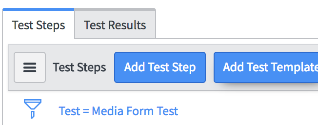

# Lab Guide - CCW0604 – Getting Started with ServiceNow Automated Testing Framework

By: Shrity Verma & Joel Fischer

# Testing an order processing application
## Goal
The goal of this lab is to familiarize you with creating tests based on the provided Test Steps. You will be testing the Media Library application that is already on your lab instance. 
Prepare for the Test

We will be using an app, which is under developemnet, called order tracking system. This apps allows employee to place a order from company store. Allow purchase department to track that order and maintain an inventory. We will write tests to tests the functionality of this app.

# Test whether the Module and Menu items related to app exists or not for different roles/users
## Goal
The goal of this lab is to make you familirize with how to test menu item and modules visibility of an application in left Navigator
### Test whether the Module and Menu items related to app exists or not for employee role
1.	Create a new **Test** record. Name it "Check order traking menu item exists". Right-click the header and **Save** the record.
2.	Click **Add Test Step** button. 
3.  Choose **Impersonate** from the list of options. Choose "Erin Smith" and click **Submit**. 
4.  Click **Add Test Step**. Under the **Application Navigator** section choose "Application Visibility". 
5.  In visible assert type select "At least these applications are visible".
6.  In Visible application select "Order processing system". Click **Submit"=**
7.  Click **Add Test Step**. Under the **Application Navigator** section choose "Module Visibility". 
8.  In visible assert type select "At least these modules are visible".
9.  In Visible Modules select "Order" Click **Submit**

### Test whether the Module and Menu items related to app exists or not for purchase department role
1.  Create a new **Test** record. Name it "Check order traking menu item exists". Right-click the header and **Save** the record.
2.	Click **Add Test Step** button. 
3.  Choose **Impersonate** from the list of options. Choose "Paul Anderson" and click **Submit**. 
4.  Click **Add Test Step**. Under the **Application Navigator** section choose "Application Visibility". 
5.  In visible assert type select "At least these applications are visible".
6.  In Visible application select "Order processing system". Click **Submit"=**
7.  Click **Add Test Step**. Under the **Application Navigator** section choose "Module Visibility". 
8.  In visible assert type select "At least these modules are visible".
9.  In Visible Modules select "Order" and "Returns". Click **Submit**

# Testing if Employee Erin can order an item using service catalog
## Goal
The Goal of this lab is to make sure employees can order items using a service catalog

1.  Create a new **Test** record. Name it "Check order traking menu item exists". Right-click the header and **Save** the record.
2.	Click **Add Test Step** button. 
3.  Choose **Impersonate** from the list of options. Choose "Employee_Erin" and click **Submit**. 
4.  Click **Add Test Step**. Under the **Service Catalog** section choose "Search for a Catalog Item".
5.  In the **Catalog item** field select "Apple iPad 3". Click **Submit**
6.  Click **Add Test Step**. Under the **Service Catalog** section choose "Open Catalog Item".
7.  Using the gear icon select step 2. Click **Submit**
8.  Click **Add Test Step**. Under the **Service Catalog** section choose "Set Variable Values".
9.  Select carrier as "AT & T Mobility", Color as "Slate",...... click submit
10. Click **Add Test Step**. Under the **Service Catalog** section choose "Set Catalog Item Quantity".
11. In the **Quantity** field select "2". Click submit
12. Click **Add Test Step**. Under the **Service Catalog** section choose "Order Catalog Item". Select Assert type as "Successfully ordered Catalog Item"
13. Click **Add Test Step** button. Choose **Impersonate** from the list of options. Choose ITIL user "Ira" and click **Submit**. 
14. Click **Add Test Step**. Under the Form catagory select "Open an Existing Record" select Table as "Request". Use the gear icon to back reference to step 6 in Record. Keep View as default. Click Submit
15. Click **Add Test Step**. Under the Form catagory select "Field Value Validation" select Table as "Request". In the conditions field add Filter condition "Stage is Requested" and "Requested for is"  use gear icon to back reference the impersonated user in step 1
13. Click **Add Test Step** button. Choose **Impersonate** from the list of options. Choose Approver as user "Amy" and click **Submit**. 
14. Click **Add Test Step**. Under the Form catagory select "Open an Existing Record" select table as approval. Use the gear icon to back reference to step 11 in Record. Keep View as default. Click Submit
15.  Click **Add Test Step**. Under the Form catagory select "Set Field Values". Select table as Approval and select Field Values as "State" "approved". Click **Submit**
17.  Click **Add Test Step**. Under the Form catagory select "Click a UI Action". Select table as "Request" and select UI action as "Save" and Assert type as "Form Submitted to server"

# Test when item is returned the item sold history table is updated accordingly (Business Rule testing)
## Goal
The goal of this lab is to make sure when an item is returned the inventory table is updated accordingly. A business rule is executed behind the scen to update the inventory table. This lab will test if business rule was executed correctly

### Create the test
### Run and you should see a browser console error
### Fix browser console error
### re-run the test

# Use a server side script to test that e-mail was successfully sent to the user with right content in the e-mail body
## Goal
The goal of this lab is to familarize you with options available when you encounter client JavaScript error.

# Add and use custom wait step for approval. (Custom step)
## Goal
The goal of this lab is to familiarize you on how to test a business rule.

# Add all the test created so far and schedule it
## Goal

