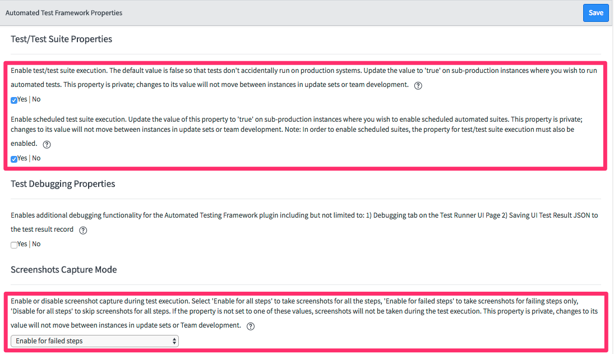
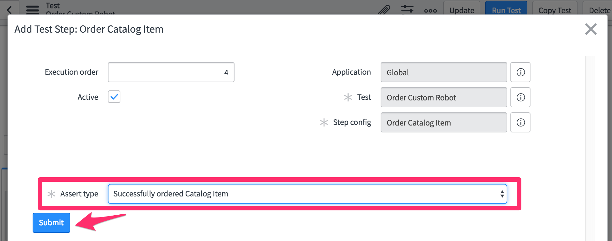
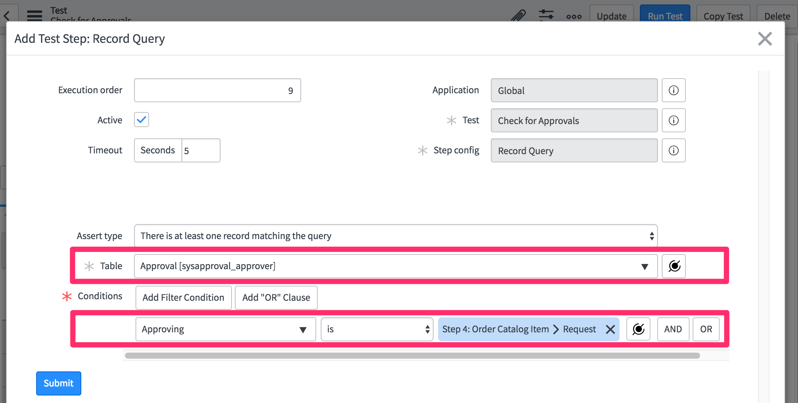

# Testing a Custom Robots application
The goal of this lab is to familiarize you with creating tests based on the provided Test Steps. We will be using an app - currently under development - called "Custom Robots". This app allows a buyer to order robots parts via service catalog. It enables the seller to track and approve the order. We will write tests to validate critical use cases of this app.

# Exercise 1: Setup
## Exercise 1(a) Log in to your provided instance
1. Navigate to the unique instance URL provided to you.
1. Log on with provided credentials.

## Exercise 1(b) Run test suites
1. On your instance, locate and find the **Automated Test Framework->Suites** module and open it.
1. Open the **Test Suite with Several Successful Members** suite. Note the message that says "Running tests and test suites is disabled. Enable Tests and Test Suites Here". By default running the Automated Test Framework is disabled on any instance. Click the link to open the properties page.
 
1. Enable test suite execution and scheduled execution. Enable test debugging properties and set screenshot capture mode to **Disable for all steps**. Click **Save** at the bottom of the page.
    
    **Note** - in general it is good practice to enable screenshots for failed tests. For the purposes of this lab will will disable that for both speed of execution and bandwidth reasons.

1. Click the **Run Test Suite** button.
    ![Run test suite button](
1. Look at the modal window that opens. Click **Run Test Suite**.
    
1. Watch the tests as they run in the opened Client Test Runner
1. Return to the original browser window. Click the **Go To Result** button and inspect the results.
    
1. Navigate back to **Suites** and open the record for **Parent Suite With A Failing Child**
1. Run that and inspect the results.
1. Look at the records under **All Test Suite Results** and examine the differences between successful and failed tests.

# Exercise 2: Application Navigation Testing
The goal of this section is to familiarize with how to test menu item and modules visibility of an application in application navigator

### Test whether the Module and Menu items related to app is visible to the buyer
1. Click the **Tests** module
  
  

1. Click **New**. 


1. In the **Name** add "Application Visibility" in the Description add "Test to see whether application Custom Robots and Module Orders are visible" 
1. Click **Save** to save the record


1. Click **Add Test Step** button. 


1. In the **Server** category Choose **Impersonate** from the list of options. Click **Next**


1. Choose "Abel Tuter" and Click **Submit** or **Update**


1. Click **Add Test Step**. Under the **Application Navigator** category choose "Application Menu Visibility". Click **Next**
1. In Visible assert type select "At least these application menus are visible"
1. In Visible application select "Custom Robots". Click **Submit** or **Update**

1. Click **Add Test Step**. Under the **Application Navigator** category choose "Module Visibility"
1. In Visible assert type select "At least these modules are visible"
1. In Visible Modules select "Orders" Click **Submit** or **Update**

1. Click **Run Test** button

1. Click **Run Test** in the "Pick a browser" model window.


# Exercise 3: Service Catalog testing
## Exercise 3(a) Order Catalog Item
The Goal of this section is to make sure buyer can order parts to build custom robots using the service catalog

1. Create a new **Test** record. Name it "Order Custom Robot". Right-click the header and **Save** the record
1. Click **Add Test Step** button
1. In the **Server** category choose **Impersonate** from the list of options. Choose "Abel Tuter" and Click **Submit** or **Update**
1. Click **Add Test Step**. Under the **Server** category choose "Search for a Catalog Item"
    1. Set the Search Term to "Customized Robot"
    1. Set Catalog to "Service Catalog"
    1. Set Category to "Robotics"
    1. Set Assert Item to "Request new product" and Click **Submit**

    

1.  Click **Add Test Step**. In the **Service Catalog** category choose "Open Catalog Item"
1.  Next to the Service Catalog variable, click the mapping icon  and in the step reference pop-up, select "Step 2: Search for a Catalog Item." > "Catalog Item ID". 
1. Click **Submit** or **Update**


1. Click **Add Test Step**. Under the **Service Catalog** category choose "Set Variables Values"
     1. Select "choose_arms " as "Articulated Clamps"
     1. Select "choose_body" as "360 rotating platform"
     1. Select "choose_head" as "Floating orb with LED face"
     1. Select "choose_legs" as "Levitation Drive" and click **Submit** or **Update**

    

1. Click **Add Test Step**. Under the **Service Catalog** category choose "Order Catalog Item". Click **Next**
1. Select Assert type as "Successfully ordered Catalog Item" and click **Submit** or **Update**



1. Click **Run Test** button
1. Click **Run Test** in the "Pick a browser" model window.

## Exercise 3(b) : Test approval of the order
The Goal of this section is to make sure the above order goes thru the approval process

1. Click "Order Custom Robot" Test in the Test Module. 
1. Click **Copy Test** button. Change the Name to "Check for Approvals" 


1. Click **Add Test Step**  Under **Server** category choose **Impersonate** from the list of options. Choose "ITIL User" and click **Submit**
1. Click **Add Test Steps**. Under **Forms** category choose "Open Existing Record"
    1. In "Table" select "Request" In the "Record section" using mapping icon map it to "Step 5"
    
1. Click **Add Test Steps**. Under **Forms** category choose "Field Value Validation" 
    1. Select "Table" as "Request"
    1. In "Condition" dropdown select "Stage" "is" "Requested"
    1. Click "And" Button
    1. In the dropdown select "Requested for" "is" using mapping icon map it to step 1
      
1. Click **Add Test Step**  Under **Server** category choose **Impersonate** from the list of options. Choose "Eric Schroeder" and click **Submit**
1. Click **Add Test Step**  Under **Server** category choose **Record Query** step
    1. Select "Table" as "Approval[sysapproval_approver]"
    1. In the condition dropdown select "Approving" "is" using the mapping icon map it to "step 5" and click **Submit**
    
1. Click **Add Test Step**   Under **Forms** category choose **Open Existing Record** step
    1. Select "Table" as "Approval"
    1. In The Record using the mapping icon map it to step 10 and click **Submit**
    
1. Click **Add Test Step**   Under **Forms** category choose **Set Field Values** step
    1. Select "Table" as "Approval"
    1. In "Field Value" select "State" "Approved" and click **Submit**
     
1. Click **Add Test Step**   Under **Forms** category choose **Click a UI Action** step
    1. Select "Table" as "Request [sc_request]"
    1. Select "UI Action" as "Save" from the reference option
    1. Select Assert type as "Form submitted to server" and click **Submit**
    

1. Click **Run Test** button
1. Click **Run Test** in the "Pick a browser" model window.

# Exercise 4: Business rule testing

The goal of this section is to demonstrate testing a business rule that generates an Order upon request approval. 

1. Click "Check for Approvals" Test in the Test Module. 
1. Click **Copy Test** button. Change the Name to "Order created in order table" 
1. Click **Add Test Step**. Under the **Server** category select "Record Query" 
1. In the Table option select "Order" table
1. In the condition drop down select "Show Related Fields" column. Click the drop down again select "Request Item ==> Requested Item fields"

1. Click the drop down again select "Request"

1. Select Step 5 using back reference in the condition

1. Click **Submit** button
1. Click **Run Test** button
1. Click **Run Test** in the "Pick a browser" model window.


# Run Server Script 
## Goal
The goal of this section is to make sure when an item is shipped an e-mail was sent with right content in it. We will use Run Server Side script test step to test that

1. Click **Add Test Step**  Under the **Server** category choose **Impersonate** from the list of options. Choose "Abel Tuter" and click **Submit**
1. Click **Add Test Step**. Under the **Server** category choose **Record Insert** step click **Next**
1. Fill in the step as below screen and click **Update** or **Submit**


1. Click **Add Test Step**. Under the **Server** category choose **Record Update** step click **Next**
1. Fill in the step as show in below screen and click **Update** or **Submit**

   
         **Note** We are using dynamic date on order update
1. Click **Add Test Step**. Under the **Server** category choose **Run Server Side Script** step click **Next**
1. Copy below code in the script box and click **Update** or **Submit**

```javascript

     (function(outputs, steps, stepResult, assertEqual) {
	// specify first step sys_id
	var firstStepSysId = 'a598fe3b732113003c7ceeadfff6a7c5';

	// get order from first step
	var orderId = steps(firstStepSysId).record_id;
	var order = new GlideRecord('sn_custom_robots_order');
	order.get(orderId);
    var assertOrderExists = {
          name: "assert order exists",
          shouldbe: 1,
          value: order.getRowCount(),
    };
    assertEqual(assertOrderExists);
	gs.info('found order: ' + order.sys_id);

	// get buyer's first name from order
	var user = new GlideRecord('sys_user');
	user.get(order.buyer);
    var assertUserExists = {
          name: "assert user exists",
          shouldbe: 1,
          value: user.getRowCount(),
    };
    assertEqual(assertUserExists);
	gs.info("found buyer: " + user.sys_id + ", first name: " + user.first_name);

	// wait for email to be created from business rulea after order updated to shipped
	var counter = 0;
	while (counter++ < 20) {
		// check if email found
		var email = new GlideRecord('sys_email');
		email.addQuery('subject', 'LIKE', '%' + order.number + '%');
		email.query();
		if (email.next()) {
			gs.info('email body contents first 200 chars: \n' + email.body.substring(0,200));
			var assertEmailContainsBuyerFirstName = {
			name: "email body contains recipient first name",
			shouldbe: true,
			value: (email.body.indexOf(user.first_name) != -1),
			};
			assertEqual(assertEmailContainsBuyerFirstName);
			return true;
		}
		gs.sleep(1000);
	}
	// if reached here, the email wasn't sent or took longer than 20 seconds
	stepResult.setOutputMessage("Failed to find email in 20 seconds");
	return false;

})(outputs, steps, stepResult, assertEqual);
// uncomment the next line to execute this script as a jasmine test
//jasmine.getEnv().execute();
```

# Add new Test Step using Step config
## Goal
The goal of this section is to familiarize you with options available when you encounter client-side JavaScript error.

# Add all the test created so far and schedule it
## Goal
1. 


