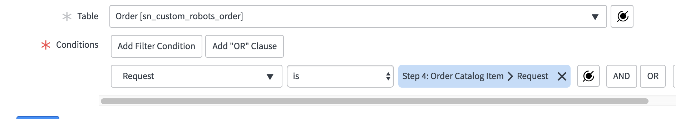

# Testing a Custom Robots application
## Goal
The goal of this lab is to familiarize you with creating and running tests, as well as an exploration of the latest features in the Automated Test Framework

We will be using an app - currently under development - called "Custom Robots". This app enables a buyer to order custom robots via Service Catalog. The seller can track and approve the order state and sends the buyer an email when the order is complete. We will write tests to validate critical use cases of this app

# Exercise 1: Setup
## Exercise 1(a) Log in to your instance
1. Log in to a Kingston or London instance.  If you need an instance, request a personal developer instance from the [Developer Portal](developer.servicenow.com)
2. Log in to the instance as the **admin** user
3. Use the Application Navigator to open **System Applications \> Studio**  
4. In the Load Application dialog, click the **Import From Source Control** button
5. In the Import Application dialog, configure the URL:  **https://github.com/ServiceNowEvents/K18-CCW0604-Getting-Started-With-ATF.git**.  Leave the User name and Password fields blank.  

6. Click the **Import** button
7. When the application import is completed, click the **Select Application** button  
8. In the Load Application dialog, click the link to the **Custom Robots** application to open it for editing in Studio.  
  


## Exercise 1(b) Enable and run a test
This exercise demonstrates
* Running a test that loads a form in the Client Test Runner
* How to handle client errors found on form under test

***Enable the test framework to run tests:***

1. On your instance, locate the **Automated Test Framework** -> **Tests** module and open it
2. Enable test suite execution and scheduled execution. Enable test debugging properties and set screenshot capture mode to **Enable for failing steps**. Click **Save** at the bottom of the page

    
    
    **Note** - in general it is good practice to enable screenshots for failed steps for both speed of execution and bandwidth

***Now that you've enabled tests, let's run one:***

3. Navigate to **Automated Test Framework** -> **Tests**

    
4. Filter for, and open, an existing test "Open new order form"
5. Click the **Run Test** button

    
6. In the "Pick a Browser" modal click **Run Test** button to open a new browser window in which to run the forms-based test

    
7. Watch the test as it runs in the newly opened **Client Test Runner** window

    
8. Return to the original browser window where you started the test. Click the **Go To Result** button and view the results

    
9. The test result shows that the test failed due to a client error
    * A JavaScript error occurred on the form that the test loaded in the first step
    * The test result shows which step, what the error was, and the related screenshot of which page the error was reported

    

***The test reported a client error, note it for the application developer:***

10. Add the failing **Test Log** to the warning list by clicking **Add all client errors to warning list**

    
    * This action adds a record to the **Whitelisted Client Errors** table

        
11. Navigate to **Automated Test Framework** -> **Tests**
12. Open the same test "Open new order form" again and run it. The test should pass with status `Success with Warning(s)`
    * More information about the warning can be found on the Test Result
13. Close the **Client Test Runner** window. You will open a new one in the next exercise.

***Now you can continue designing tests without being blocked by non-intrusive client errors***


# Exercise 2: Application Navigator Role-based Testing
This exercise demonstrates validation of role-based access to application menus and modules in our app
1. Navigate to the **Automated Test Framework** -> **Tests** module
2. Click **New** button

    
3. Set the `Name` to "Application Visibility" and the `Description` to "Application menu Custom Robots and module Orders are visible to the user"
4. Click **Save** to save the record

    

***Add Test Step 1 to Impersonate a user with the roles we want to validate:***

5. Click **Add Test Step** button

    
6. In the **Server** category choose **Impersonate** from the list of step options and click **Next** button

    
7. Set `User` to "Abel Tuter" and click **Submit** button

    
    *Abel Tuter has a role that enables them to view the application menu and module we want to test*

***Add Test Step 2 to check application menu visibility:***

8. Click **Add Test Step**. Under the **Application Navigator** category choose **Application Menu Visibility** and click **Next**
9. In `Visible assert type` select `At least these application menus are visible`
10. In `Visible application menus` type and then select `Custom Robots` and click **Submit**

    

***Add Test Step 3 to check module visibility:***

11. Click **Add Test Step** button. Under the **Application Navigator** category choose **Module Visibility** and click **Next**
12. In `Visible assert type` select `At least these modules are visible`
13. In `Visible modules` type and then select `Orders` and click **Submit**

    

14. Check that your test has the following steps:

     

15. Click **Run Test** button on the test form

    
16. Click **Run Test** in the "Pick a browser" model window. Then watch the test run in the separate Client Test Runner window

    
17. Expected Result - Test should be successful.

    
18. Click **Go to Result** button to view the Test Result
19. On the **Test Result** form notice the following:
    * The **Test Result** has a `Status` of `Success`
    * There is a **Step Result** for each **Step** in the test
    * Each **Step Result** has a `Status` of `Success`

    

    *Note: You can find a completed sample of this test named `Exercise 2 (completed sample): Application Visibility`*


# Exercise 3: Service Catalog testing
## Exercise 3(a) Order Catalog Item
This exercise demonstrates that a buyer can order a customized robot with specified parts using the service catalog

1. Create a new **Test** record. Name it "Order Custom Robot". Click **Save** button

***Add step 1 to impersonate the buyer that will use the service catalog:***

2. Click **Add Test Step**
3. In the **Server** category choose **Impersonate** from the list of steps.
4. Choose "Abel Tuter" and click **Submit**

***Add step 2 to open the catalog item to test:***

5.  Click **Add Test Step**. In the **Service Catalog** category choose **Open Catalog Item** and click **Next**
6. Set the `Catalog Item` to `Customized Robot` and click **Submit**

    

***Add step 3 to set the catalog item variable values:***

7. Click **Add Test Step**. Under the **Service Catalog** category choose **Set Variables Values** and click **Next**
8. Set the **Catalog Item** `Variable Values` as follows
     1. Select `choose_arms` as `Articulated Clamps`
     2. Select `choose_body` as `360 rotating platform`
     3. Select `choose_head` as `Floating orb with LED face`
     4. Select `choose_legs` as `Levitation Drive`
     5. click **Submit**

    

***Add step 4 to submit the order:***

9. Click **Add Test Step**. Under the **Service Catalog** category choose **Order Catalog Item** and click **Next**
10. Set `Assert type` as `Successfully ordered Catalog Item` and click **Submit**

    

***Upon returning to the test form, check your steps and then run the test:***

11. Check that your steps appear as follows:

    

12. Click **Run Test** button on the Test form
13. Click **Run Test** button in the "Pick a browser" modal window
14. Test should be successful

    *Note: You can find a completed sample of this test named `Exercise 3a (completed sample): Order Custom Robot`*


## Exercise 3(b) : Test approval of the request
This exercise adds onto the test you created in Exercise 3(a) and demonstrates how to validate a service catalog approval workflow

***First copy the test from Exercise 3(a) and rename it:***

1. Go to **Automated Test Framework** -> **Tests**
2. Filter for and open the "Order Custom Robot" Test that you created during Exercise 3(a)

    *NOTE: If you did not complete Exercise 3(a), you can start this exercise by using test `Exercise 3a (completed sample): Order Custom Robot`*

3. Click **Copy Test** button

    

4. On the resulting new **Test** form, change the `Name` to "Check for Approvals" and click **Update**

***Add step 5 to impersonate the ITIL user who can view the request record:***

5. Reopen this new "Check for Approvals" test
6. Click **Add Test Step**.  Under **Server** category choose **Impersonate** from the list of options. Choose "ITIL User" and click **Submit**

    

***Add step 6 to open a form to the request created by the catalog item order:***

7. Click **Add Test Step**. Under **Forms** category choose **Open Existing Record** and click **Next**
8. Set `Table` as `Request [sc_request]`

    

9. Map `Record` to `Step 4: Order a Catalog Item > Request`:
    1. First click the `Record` variable's back reference icon  to open a list of steps that are defined to run earlier than this step during test execution

        

    2. Here is what the list of mappable steps should look like in the pop-up:

        

    3. Click option `Step 4: Order Catalog Item` and then click `Request`

        

    4. Now `Request` should have a `pill` named `Step 4: Order Catalog Item > Request`

        

        ***This mapping enables Step 5 to access the request created by Step 4***

    5. Click **Submit** to save the step

10. Verify that your test has 6 steps as shown in this figure:

    

***Add step 7 to validate the request form matches the values we expect:***

11. Click **Add Test Step**. Under **Forms** category choose **Field Values Validation** and click **Next**

    ***NOTE:*** refer to **Figure 3B-1** (below) for these steps:
    1. Set `Table` as `Request [sc_request]`
    2. Add the following `Conditions`:
    3. First condition:
        1. Choose field: `Stage`
        2. Operator: `is`
        3. Value: `Requested`
    4. Click **And** button at the end of the first condition's row
    5. Second condition:
        1. Choose field: `Requested for`
        2. Operator: `is`
        3. Value: Using the back reference icon , map this value to `Step 1: Impersonate > User`
    6. Click **Submit** button to save the step

    ***Figure 3B-1***
    

***Add step 8 to impersonate the user that will approve the request:***

12. Click **Add Test Step**. Under **Server** category choose **Impersonate** and click **Next**. Set the `User` to "Eric Schroeder" and click **Submit**

***Add step 9 to retrieve the approval record by mapping to the service catalog request***

13. Click **Add Test Step**. Under **Server** category choose **Record Query** step and click **Next**
    1. Set `Table` as `Approval [sysapproval_approver]`
    2. In the conditions dropdown, set the first condition as follows:
        1. Field: `Approving`
        2. Operator: `is`
        3. Value: using back reference icon , map it to `Step 4: Order Catalog Item > Request` and click **Submit**
    
        

***Add step 10 to reopen the approval record we retrieved in step 9:***

14. Click **Add Test Step**. Under **Forms** category choose **Open Existing Record** step
    1. Set `Table` as `Approval [sysapproval_approver]`
    2. In The Record using the back reference icon  map it to `Step 9: Record Query > First record` and click **Submit**

        

***Add step 11 to set the approval state to Approved:***

15. Click **Add Test Step**. Under **Forms** category choose **Set Field Values** step
    1. Select `Table` as `Approval [sysapproval_approver]`
    2. In the `Field Values` dropdown, set `State` as `Approved` and click **Submit**

        

***Add step 12 to Save the Approved state:***

16. Click **Add Test Step**. Under **Forms** category choose **Click a UI Action** step
    1. Set `Table` as `Request [sc_request]`
    2. Set `UI Action` as `Update` (use the first option)
        * If you inspect the Info ("i") icon on the UI action field it should show the preview of the UI Action record having an `Action name` of "sysverb_update"
    3. Set `Assert type` as `Form submitted to server` and click **Submit**

    

***Review your test and confirm it has the following steps:***


17. Return to your "Check for Approvals" test form
18. Click **Run Test** button
19. Click **Run Test** in the "Pick a browser" model window
20. The test should be successful

    *Note: You can find a completed sample of this test named `Exercise 3b (completed sample): Check for Approvals`*


# Exercise 4: Testing business rules

This exercise demonstrates how to test the behavior of a business rule. In this scenario the business rule creates an Order upon approval of the service catalog request that the test creates

1. Go to **Automated Test Framework** -> **Tests**
2. Filter for and open your completed "Check for Approvals" Test that you worked on during the last two exercises

    *NOTE: If you did not complete Exercise 3(b), you can start this exercise by using test `Exercise 3b (completed sample): Check for Approvals`*

***Copy the original test and its steps:***

3. Click **Copy Test** button. Change the Name to "Order created in order table". Then right-click the header of the test form and choose context menu option `Save`

    

***Add step 13 to query for an order that was created from the request this test is defined to create***

4. Click **Add Test Step**. Under the **Server** category select **Record Query** 
5. Set `Table` to `Order [sn_custom_robots_order]`
6. To successfully query for the order in relation to its request, you'll need to `dot-walk` the order's `Requested Item` field:
    1. Under `Conditions`, click the `-- choose field --` dropdown and select `Show Related Fields`
    2. Click the same dropdown a second time and select `Request Item ==> Requested Item fields`

        
    3. Click the same dropdown a third time and select `Request`, that's nested under `.Request Item >> Requested Item Fields`
    
        *Note: this is how to `dot-walk` from the order's "Requested Item" reference to its "Request" reference*

        
    4. Set the `Request` value to `Step 4: Order Catalog Item > Request` using back reference icon 

        
        *The back reference pill should appear as follows:*
        
    5. Click **Submit** to submit the step

***Run the test to confirm an order was created by the service catalog request created earlier in the test:***

11. Click **Run Test** button on the test form
12. Click **Run Test** button in the "Pick a browser" model window.
13. Test should be successful

    *Note: You can find a completed sample of this test named `Exercise 4 (completed sample): Order created in order table`*

***We have verified the business rule successfully created an order upon approval of the `Customized Robot` request***


# Exercise 5: Using a Run Server Side Script
This exercise demonstrates running server-side script (Rhino) that can query the database and make assertions all within the same step

In this scenario the requested item will be marked by the manufacturer as Shipped, and a **Notification** e-mail will be sent with content that you intend to validate. We will use Run Server Side script test step to test that e-mail was sent once order was shipped

1. Navigate to **Automated Test Framework** -> **Tests**
2. Create a new **Test** record. Name it "Check e-mail Notification". Right-click the header and **Save** the record

***Add Step 1 to impersonate a user with access to the application:***

3. Click **Add Test Step** button.  Under the **Server** category choose **Impersonate** from the list of options and click **Next**
4. Choose "Eric Schroeder" and click **Submit**

***Add Step 2 to insert an order record to bypass the service catalog use cases:***

5. Click **Add Test Step** button. Under the **Server** category choose **Record Insert** step and click **Next** button
    1. Select table as Order
    2. Add `Arms` as `Articulated clamps`
    3. Add `Body` as `Trash compactor`
    4. Add `Head` as `Binocular head with dual shades`
    5. Add `legs` as `Tank treads`
    6. Add `Status` as `Open`
    7. Add `Buyer` as "Abel Tuter"
    8. Click **Submit**

    

***Add Step 3 to to update the Order and trigger a notification email event:***

6. Click **Add Test Step**. Under the **Server** category choose **Record Update** step and click **Next** button
7. Using back reference icon  select `Step 2: Record Insert > Record`
8. Set the first entry to the Field Value `Shipped` and value as `javascript:gs.nowDateTime()` and click **Submit** button

   
        *Note: This is an example of dynamically setting a date in **Record Update**. This can also be done with **Set Field Values** and **Set Variable Values** steps*

***Add Step 4 to validate that the email was sent and assert its contents***

9. Click **Add Test Step** button. Under the **Server** category choose **Run Server Side Script** step and click **Next** button
10. Copy the below code and paste it over the top of the contents of the `Step execution script` script editor

```javascript
(function(outputs, steps, stepResult, assertEqual) {
    // specify the Test Step sys_id that created the Order record
    var orderStepSysId = 'TODO_ENTER_STEP_1_SYS_ID_HERE';

    // get order from record insert step
    var orderId = steps(orderStepSysId).record_id;
    var order = new GlideRecord('sn_custom_robots_order');
    order.get(orderId);
    var assertOrderExists = {
        name: "assert order exists",
        shouldbe: 1,
        value: order.getRowCount(),
    };
    assertEqual(assertOrderExists);
    gs.info('confirmed order:\n:order.sys_id' + order.sys_id + '\nnumber: ' + order.number + '\nshipped date: ' + order.shipped);

    // get buyer's first name from order
    var user = new GlideRecord('sys_user');
    user.get(order.buyer);
    var assertUserExists = {
        name: "assert user exists",
        shouldbe: 1,
        value: user.getRowCount(),
    };
    assertEqual(assertUserExists);
    gs.info("\nconfirmed buyer:\nbuyer.sys_id: " + user.sys_id + "\nname: " + user.name);

    // wait for email to be created from business rule after order updated to shipped
    var counter = 0;
    while (counter++ < 20) {
        gs.info('query attempt #: ' + counter);
        // check if email found
        var email = new GlideRecord('sys_email');
        email.addQuery('subject', 'LIKE', '%' + order.number + '%');
        email.setLimit(1);
        email.query();
        if (email.next()) {
            gs.info('email body contents first 400 chars: \n' + email.body.substring(0,400));
            var assertEmailContainsBuyerFirstName = {
            name: "email body contains recipient first name",
            shouldbe: true,
            value: (email.body.indexOf(user.first_name) != -1),
            };
            assertEqual(assertEmailContainsBuyerFirstName);
            return true;
        } else
            gs.info('email not yet found');

        gs.sleep(1000);
    }
    // if reached here, the email wasn't sent or took longer than 20 seconds
    stepResult.setOutputMessage("Failed to find email in 20 seconds");
    return false;

})(outputs, steps, stepResult, assertEqual);
```

* Example

    

11. Click **Submit** to return to the test form

***Before moving onto the next step, you must define a previous step `sys_id` in the Run Server Side Step `Step execution script` field:***

12. On the test form right-click **Record Insert** step in the test and select `Copy sys_id` as follows:

    

13. Now click on `Run Server Side Script` step to open its record
14. Look in the `Step execution script` field and find the following line
    * `var orderStepSysId = 'TODO_ENTER_STEP_1_SYS_ID_HERE';`
15. Replace `TODO_ENTER_STEP_1_SYS_ID_HERE` with the sys_id that you copied in **step 12** above

    
16. Click **Update** to save and return to the test form

***Confirm your test steps***


***Run the test, it will only pass after it has found an email and asserted its contents:***

14. Click **Run Test** button
15. Test should be successful

    *Note: You can find a completed sample of this test named `Exercise 5 (completed sample): Check e-mail Notification`*

***The Run Server Side Script test finds the email by order number and asserts its contents***


<!-- 
# Exercise 6: Create a new Step Configuration
This exercise demonstrates how to create a new **Step Configuration** that can automatically approve requests. The Step finds and approves the specified request with specified approval user

1. Navigate to **Automated Test Framework** -> **Administration** -> **Step Configurations**

    
2. Click **New** button
3. Fill up the form as below
    1. `Name` as "Approve Request"
    2. `Step environment` as `Server-Independent`
    3. `Category` as `Server`
    4. `Template Reminder` as "Approves this request by approver"
    5. `HTML description` as "Approves this request by approver"
    6. `Order` as 100

    
4. In the `Description generation script` add "Approve request" to the default value

```javascript
    function generateDescription() {
        // the global variable 'step' represents the current glide record
        var description = GlideSysMessage.format("Approve request");
        // your code here
        return description;
    }
    generateDescription();
```
5. In the `Step execution script` field add following code:

```javascript
(function executeStep(inputs, outputs, stepResult, timeout) {
    
    var request = new GlideRecord('sc_request');
    request.get(inputs.u_request);
    var approver = new GlideRecord('sys_user');
    approver.get(inputs.u_approver);

    // wait for approval to appear
    var counter = 0;
    while (counter++ < 60) {
        var approval = new GlideRecord('sysapproval_approver');
        approval.addQuery('document_id', request.sys_id);
        approval.addQuery('state', 'requested');
        approval.query();
        if (approval.next()) {
            approval.state = 'approved';
            if (approval.update()) {
                stepResult.setOutputMessage(gs.getMessage("successfully approved request '{0}' for user {1}", [request.number, approver.name]));
                stepResult.setSuccess();
                return;
            } else {
                stepResult.setOutputMessage(gs.getMessage("failed to approve request '{0}' for user {1}", [request.number, approver.name]));
                stepResult.setFailed();
                return;
            }
        }
        gs.sleep(1000);
    }
    stepResult.setOutputMessage("failed to find specified approver user");
    stepResult.setFailed();
    return;

}(inputs, outputs, stepResult, timeout));
```

* Example of what pasting the script should look like:

    

6. Click **Submit** button
7. Open "Approve Request" step configuration form
8. Under the step configuration's related list **Input Variables**, click **New** button

    
9. Set the following to create the first reference input variable
   1. `Type`: `Reference`
   2. `Label`: Request
   3. `Column Name`: u_request
   4. Under **Reference Specification** related list set `Reference` to `Request (sc_request)`

        
10. Click **Submit** or **Update** button to return to the step configuration form
11. Under related list **Input Variables** click **New** button
12. Set the following to create the second reference input variable
    1. `Type`: `Reference`
    2. `Label`: Approver
    3. `Column Name`: u_approver
    4. Right-click the form header and click **Save**
    4. Under **Reference Specification** related list, set `Reference` to `User (sys_user)`

    
13. Click **Submit** or **Update**

**Now we will use this new step in a lab-provided test to approve the request**

14. Navigate to **Automated Test Framework** -> **Tests**


15. Click "Order Custom Robot" Test in the Test Module. 
16. Click **Copy Test** button. Change the Name to "Approve Order using Custom Step" 
17. Click **Add Test Step**. Under the **Server** category look for the new step added **Approve Request**
18. Back reference to step 4 and set `Approver` as "Eric Schroeder"

    
19. Click **Submit** or **Update**
20. Click **Add Test Step**. Under the **Server** category select **Record Query** Step
    1. Select table as `Orders (sn_custom_robots_order)` table
    2. *dot-walk* to `Request Item.Request` like we did in exercise 4 steps 5 through 7 and back reference to `Step 4`, and then click **Submit** or **Next** button

    
21. Click **Run Test** button on the test form
22. Click **Run Test** in the "Pick a browser" model window.
23. Test should be successful -->


# Exercise 6: Create and schedule a Test Suite

This exercise demonstrates how to create and run a **Test Suite** and then add it to a **Schedule** so that it can run later

***Create a Test Suite using existing tests:***

1. Navigate to **Automated Test Framework** -> **Suites**

    
2. Click **New** button
3. Add Name as "My Lab Test Suite"

    
4. In the Related List `Test Suite Tests`, click **New** button

    *Note: An alternative to clicking New button is to type the test names where the empty row states `Insert a new row...` and then hit **Enter** key*

    
5. Select `Application Visibility`, click **Submit** button

    
6. Repeat Step 4 and 5 and add the tests you created to this test suite
    1. Order Custom Robot
    2. Order created in order table
    3. Check for approvals
    4. Check e-mail Notification
    
    * *Note Samples of each of these tests can be found in the Tests list with naming format:*
        * `Exercise # (completed sample): NAME`
    <!-- 5. Approve order using custom step -->

    

***Create a Schedule:***

7. Navigate to **Automated Test Framework** -> **Schedules**
8. Click **New** button
9. Add Name as "My Lab Test Schedule"
10. Click **Save** button
11. Click **New** button
12. Using Lookup list add the suite you created ("My Lab Test Suite") to this schedule

    

***Open a Scheduled Client Test Runner:***

13. Navigate to **Automated Test Framework** -> **Run** -> **Scheduled Client Test Runner**, right-click and select **Open Link in New Tab**

***Execute the schedule:***

14. Go back to main tab and navigate to **Automated Test Framework** -> **Schedules**
15. Open "My Lab Test Schedule"
16. Click **Execute Now** button to immediately execute the schedule and show a progress viewer of the suites as they run

***Congratulations you have successfully completed the lab!***

# Conclusion
In this lab you have learned how to test various aspects of your customizations on the Now Platform:
* Exercise 1:
    * Enable test execution on your instance
    * Run a test that uses a **Client Test Runner**
    * Whitelist client errors (JavaScript errors that appear on forms under test) so you can continue writing and running tests
* Exercise 2:
    * Create a **Test** and add **Test Steps** to it
    * Review **Test Results**
    * Use **Test Steps** in the new **Application Navigator** step category
* Exercise 3a:
    * Test **Service Catalog** requests
* Exercise 3b:
    * Test approval **workflows**
    * Use data created in earlier **Test Steps** as input to later Test Steps (back referencing)
* Exercise 4:
    * Test **business rule** behavior
    * `Dot-walk` reference fields in tests for advanced query capabilities
* Exercise 5:
    * Populate test data with *dynamic dates* (`javascript:gs.nowDateTime()`)
    * Run assertions in server-side (Rhino) JavaScript
    * Test notifications (sysevent_email_action) and notification events
<!-- * Exercise 6:
    * Create your own custom Step Configurations (Category: Server) to automate complex assertions -->
* Exercise 6:
    * Build and run Test Suites
    * Build and run Scheduled Test Suites
