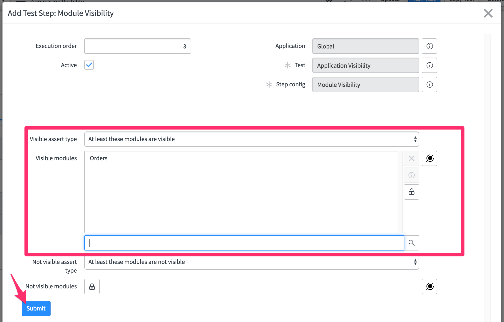
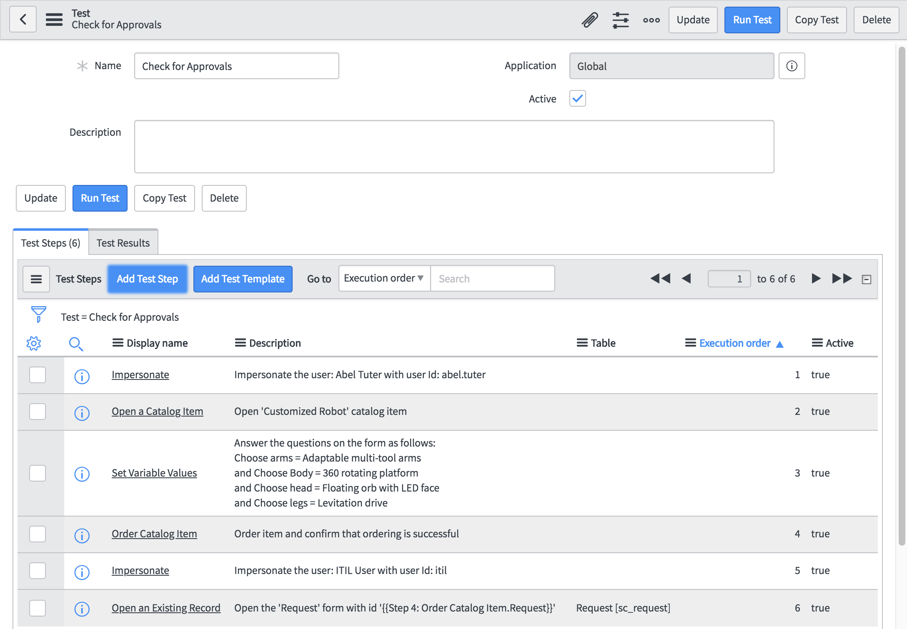
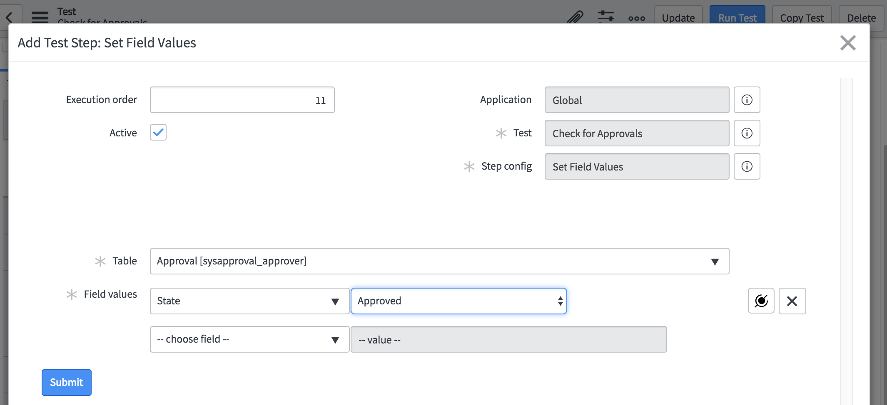
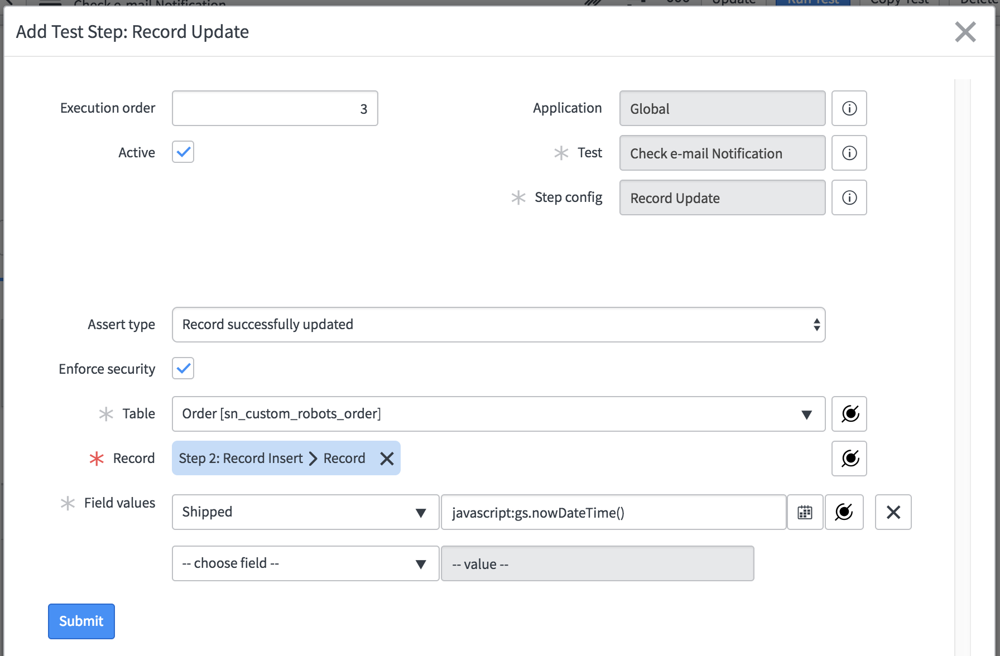

# Testing a Custom Robots application
The goal of this section is to familiarize you with creating and running tests with the latest features.

We will be using an app - currently under development - called "Custom Robots". This app enables a buyer to order custom robots via Service Catalog. The seller can track and approve the order state and sends the buyer an email when the order is complete. We will write tests to validate critical use cases of this app

# Exercise 1: Setup
## Exercise 1(a) Log in to your provided instance
1. Navigate to the unique instance URL provided to you
2. Log on with provided credentials

## Exercise 1(b) Enable and run a test
The goal of this section is to familiarize you with running a test that loads a form, and address a client error that is found during the test

***Enable the test framework to run tests:***

1. On your instance, locate the **Automated Test Framework** -> **Tests** module and open it
2. Enable test suite execution and scheduled execution. Enable test debugging properties and set screenshot capture mode to **Enable for failing steps**. Click **Save** at the bottom of the page

    
    
    **Note** - in general it is good practice to enable screenshots for failed steps for both speed of execution and bandwidth

***Now that you've enabled tests, let's run one:***

3. Navigate to **Automated Test Framework** -> **Tests**

    
4. Filter for, and open, an existing test "Open new order form"
5. Click the **Run Test** button

    
6. In the "Pick a Browser" modal click **Run Test** button to open a new browser window in which to run the forms-based test

    
7. Watch the test as it runs in the newly opened **Client Test Runner** window

    
8. Return to the original browser window where you started the test. Click the **Go To Result** button and view the results

    
9. The test result shows that the test failed due to a client error
    * A JavaScript error occurred on the form that the test loaded in the first step
    * The test result shows which step, what the error was, and the related screenshot to show on what screen the error was reported

    

***The test reported a client error, note it for the application developer:***

10. Add the failing **Test Log** to the warning list by clicking **Add all client errors to warning list**

    
    * This action adds a record to the **Whitelisted Client Errors** table

        
11. Navigate to **Automated Test Framework** -> **Tests**
12. Open the same test "Open new order form" again and run it. The test should pass with status `Success with Warning(s)`
    * More information about the warning can be found on the Test Result

***Now you can continue designing tests without being blocked by non-intrusive client errors, while the application developer can look into the root cause of the error on the application's form***

# Exercise 2: Application Navigator Role-based Testing
The goal of this section is to test application menu and module visibility of our app
1. Navigate to the **Automated Test Framework** -> **Tests** module
2. Click **New** button

    
3. Set the `Name` to "Application Visibility" and the `Description` to "Application menu Custom Robots and module Orders are visible to the user"
4. Click **Save** to save the record

    

***Add an Impersonate step so that the test runs with the necessary roles:***

5. Click **Add Test Step** button

    
6. In the **Server** category choose **Impersonate** from the list of step options and click **Next** button

    
7. Set `User` to "Abel Tuter" and click **Submit** button

    

***Add an Application Menu Visibility assertion to the test:***

8. Click **Add Test Step**. Under the **Application Navigator** category choose **Application Menu Visibility** and click **Next**
9. In `Visible assert type` select `At least these application menus are visible`
10. In `Visible application menus` select `Custom Robots` and click **Submit** or **Update**

    

***Add a Module Visibility assertion to the test:***

11. Click **Add Test Step** button. Under the **Application Navigator** category choose **Module Visibility**
12. In `Visible assert type` select `At least these modules are visible`
13. In `Visible Modules` select `Orders` and click **Submit** or **Update**

    
14. Click **Run Test** button on the test form

    
15. Click **Run Test** in the "Pick a browser" model window

    
16. Expected Result - Test should be successful. Click [X] icon to close the progress viewer

    

# Exercise 3: Service Catalog testing
## Exercise 3(a) Order Catalog Item
The goal of this section is to make sure buyer can order a customized robot with specified parts using the service catalog

1. Create a new **Test** record. Name it "Order Custom Robot". Click **Save** button

***Add step 1 to impersonate the buyer that will use the service catalog:***

2. Click **Add Test Step**
3. In the **Server** category choose **Impersonate** from the list of options. Choose "Abel Tuter" and click **Submit** or **Update**

***Add step 2 to open the catalog item to test:***

4.  Click **Add Test Step**. In the **Service Catalog** category choose **Open Catalog Item** and click **Next**
5. Set the `Catalog Item` to `Customized Robot` and click **Submit**

    

***Add step 3 to set the catalog item variable values:***

7. Click **Add Test Step**. Under the **Service Catalog** category choose **Set Variables Values** and click **Next**
8. Set the **Catalog Item** `Variable Values` as follows
     1. Select `choose_arms` as `Articulated Clamps`
     2. Select `choose_body` as `360 rotating platform`
     3. Select `choose_head` as `Floating orb with LED face`
     4. Select `choose_legs` as `Levitation Drive`
     5. click **Submit**

    

***Add step 4 to submit the order:***

8. Click **Add Test Step**. Under the **Service Catalog** category choose **Order Catalog Item** and click **Next**
9. Set `Assert type` as `Successfully ordered Catalog Item` and click **Submit**

    

***Upon return to the test form, check your steps and then run the test***

10. Check that your steps appear as follows:

    

11. Click **Run Test** button on the Test form
12. Click **Run Test** button in the "Pick a browser" model window
13. Test should be successful

## Exercise 3(b) : Test approval of the request
The goal of this section is to make sure the order is processed by the request's approval workflow (`Approval required for order price > $1000`), as well as an exploration through steps from **Form** and **Server** categories

***First copy the test from Exercise 3(a) and rename it:***

1. Go to **Automated Test Framework** -> **Tests**
2. Filter for and open the "Order Custom Robot" Test that you created during Exercise 3(a)

3. Click **Copy Test** button

    

4. On the resulting new **Test** form, change the `Name` to "Check for Approvals" and click **Update**

***Add step 5 to impersonate the ITIL user to assert the request is in Requested state:***

5. Reopen this new "Check for Approvals" test
6. Click **Add Test Step**.  Under **Server** category choose **Impersonate** from the list of options. Choose "ITIL User" and click **Submit**

    

***Add step 6 to open the form of the request created by the catalog item order:***

7. Click **Add Test Step**. Under **Forms** category choose **Open Existing Record** and click **Next**
8. Set `Table` as `Request [sc_request]`

    

9. Map `Record` to `Step 4: Order a Catalog Item > Request`:
    1. First click the `Record` variable's back reference icon  to open a list of steps that are defined to run earlier than this step during test execution

        

    2. Here is what the list of mappable steps should look like in the pop-up:

        

    3. Click option `Step 4: Order Catalog Item` and then click `Request`

        

    4. Now `Request` should have a `pill` named `Step 4: Order Catalog Item > Request`

        

        ***This mapping enables this Form step to open the request created by Step 4***

    5. Click **Submit** to save the step

8. Verify that your test has 6 steps as shown in this figure:

    

***Add step 7 to validate the request matches the values we expect:***

8. Click **Add Test Step**. Under **Forms** category choose **Field Values Validation**

    ***NOTE:*** refer to **Figure 3B-1** below for these steps:
    1. Set `Table` as `Request [sc_request]`
    2. Add the following `Conditions`:
    3. First condition:
        1. Field: `Stage`
        2. Operator: `is`
        3. Value: `Requested`
    4. Click **And** button at the end of the first condition's row
    5. Second condition:
        1. Field: `Requested for`
        2. Operator: `is`
        3. Value: Using the back reference icon , map this value to `Step 1: Impersonate > User`
    6. Click **Submit** button to save the step

    ***Figure 3B-1***
    

***Add step 8 to impersonate the user that will approve the request***

9. Click **Add Test Step**. Under **Server** category choose **Impersonate** and click **Next**. Set the `User` to "Eric Schroeder" and click **Submit**

***Add step 9 to retrieve the approval record by mapping to the catalog order***

10. Click **Add Test Step**  Under **Server** category choose **Record Query** step
    1. Set `Table` as `Approval [sysapproval_approver]`
    2. In the conditions dropdown, set the first condition as follows:
        1. Field: `Approving`
        2. Operator: `is`
        3. Value: using back reference icon , map it to `Step 4: Order Catalog Item > Request` and click **Submit**
    
        
11. Click **Add Test Step**   Under **Forms** category choose **Open Existing Record** step
    1. Select "Table" as "Approval"
    2. In The Record using the back reference icon  map it to step 10 and click **Submit**

        
12. Click **Add Test Step**   Under **Forms** category choose **Set Field Values** step
    1. Select "Table" as "Approval"
    2. In "Field Value" select "State" "Approved" and click **Submit**

     
13. Click **Add Test Step**   Under **Forms** category choose **Click a UI Action** step
    1. Select "Table" as "Request [sc_request]"
    2. Select "UI Action" as "Save" from the reference option
    3. Select Assert type as "Form submitted to server" and click **Submit**

    

14. Click **Run Test** button
15. Click **Run Test** in the "Pick a browser" model window
16. The test should be successful

# Exercise 4: Business rule testing

The goal of this section is to demonstrate testing a business rule that generates an Order upon request approval. 

1. Go to **Automated Test Framework** -> **Tests**
2. Click "Check for Approvals" Test in the Test Module. 
3. Click **Copy Test** button. Change the Name to "Order created in order table" 
4. Click **Add Test Step**. Under the **Server** category select **Record Query** 
5. In the Table option select "Order" table
6. To successfully query for the order in relation to its request, we're going to `dot-walk` the order's "Requested Item" field. In the condition drop down, select `Show Related Fields` column. Click the drop down again select `Request Item ==> Requested Item fields`

    
7. Click the same drop down again select `Request`
    **Note** this is how to `dot-walk` from the order's "Requested Item" Reference field to its "Request" reference field

    
8. Select "Step 4" using back reference icon  in the condition

    
9. Click **Submit** button
10. Click **Update** button
11. Click **Run Test** button
12. Click **Run Test** button in the "Pick a browser" model window.
13. Test should be successful


# Exercise 5: Run Server Script 
## Goal
The goal of this section is to make sure when an item is shipped an e-mail was sent with right content in it. We will use Run Server Side script test step to test that e-mail was sent once order was shipped.

1. Navigate to **Automated Test Framework** -> **Tests**
2. Create a new **Test** record. Name it "Check e-mail Notification". Right-click the header and **Save** the record
3. Click **Add Test Step** button.  Under the **Server** category choose **Impersonate** from the list of options. Choose "Abel Tuter" and click **Submit**
4. Click **Add Test Step** button. Under the **Server** category choose **Record Insert** step and click **Next** button
    1. Select table as Order
    2. Add "Arms" as "Adaptable multi-tool arms"
    3. Add "Body" as "360 rotating platform"
    4. Add "Head" as "360º rotatable dome with accessory ports"
    5. Add "legs" as "Arachnid legs"
    6. Add "Status" as "Open"
    7. Add "Buyer" as "Abel Tuter" the screen should look like below and click **Update** or **Submit** button

    

5. Click **Add Test Step**. Under the **Server** category choose **Record Update** step and click **Next** button
6. Using back reference icon  select step 2 
    1. Set the first entry to the Field Value `Shipped` and value as `javascript:gs.nowDateTime()` and click **Update** or **Submit** button

   
        **Note** We are using dynamic date on order update
7. Click **Add Test Step** button. Under the **Server** category choose **Run Server Side Script** step and click **Next** button
8. Copy below code in the script box and click **Update** or **Submit** button

```javascript

    (function(outputs, steps, stepResult, assertEqual) {
        // specify first step sys_id
        var firstStepSysId = 'TODO_ENTER_STEP_1_SYS_ID_HERE';

        // get order from first step
        var orderId = steps(firstStepSysId).record_id;
        var order = new GlideRecord('sn_custom_robots_order');
        order.get(orderId);
        var assertOrderExists = {
            name: "assert order exists",
            shouldbe: 1,
            value: order.getRowCount(),
        };
        assertEqual(assertOrderExists);
        gs.info('found order: ' + order.sys_id);

        // get buyer's first name from order
        var user = new GlideRecord('sys_user');
        user.get(order.buyer);
        var assertUserExists = {
            name: "assert user exists",
            shouldbe: 1,
            value: user.getRowCount(),
        };
        assertEqual(assertUserExists);
        gs.info("found buyer: " + user.sys_id + ", first name: " + user.first_name);

        // wait for email to be created from business rule after order updated to shipped
        var counter = 0;
        while (counter++ < 20) {
            // check if email found
            var email = new GlideRecord('sys_email');
            email.addQuery('subject', 'LIKE', '%' + order.request_item.request + '%');
            email.query();
            if (email.next()) {
                gs.info('email body contents first 200 chars: \n' + email.body.substring(0,200));
                var assertEmailContainsBuyerFirstName = {
                name: "email body contains recipient first name",
                shouldbe: true,
                value: (email.body.indexOf(user.first_name) != -1),
                };
                assertEqual(assertEmailContainsBuyerFirstName);
                return true;
            }
            gs.sleep(1000);
        }
        // if reached here, the email wasn't sent or took longer than 20 seconds
        stepResult.setOutputMessage("Failed to find email in 20 seconds");
        return false;

    })(outputs, steps, stepResult, assertEqual);
```
8. Right-click "Record Insert" step in the test and copy sys_id like below

    
9. Copy the sys_id in this line `var firstStepSysId = 'TODO_ENTER_STEP_1_SYS_ID_HERE';`

    
10. Click **Run Test** button
11. Test should be successful

# Exercise 6: Create a new Step Configurations
## Goal
The goal of this section is to create new step config and use that step in an existing test. The Step automatically finds and approves the specified request with specified user that can approve it

1. Navigate to **Automated Test Framework** -> **Administration** -> **Step Configurations**

    
2. Click **New** button
3. Fill up the form as below
    1. Name as "Approve Request"
    2. Step environment as `Server-Independent`
    3. Category as `Server`
    4. Template Reminder as "Approves this request by approver"
    5. HTML description as "Approves this request by approver"
    6. Order as 100

    
4. In the `Description generation script` make sure you see below code if not add it

```javascript
    function generateDescription() {
        // the global variable 'step' represents the current glide record
        var description = GlideSysMessage.format("Approve indicated request ");
        // your code here
        return description;
    }
    generateDescription();
```
5. In the `Step execution script` field add following code

```javascript
    (function executeStep(inputs, outputs, stepResult, timeout) {
        
        var request = new GlideRecord('sc_request');
        request.get(inputs.u_request);
        var approver = new GlideRecord('sys_user');
        approver.get(inputs.u_approver);

        // wait for approval to appear
        var counter = 0;
        while (counter++ < 60) {
            var approval = new GlideRecord('sysapproval_approver');
            approval.addQuery('document_id', request.sys_id);
            approval.addQuery('state', 'requested');
            approval.query();
            if (approval.next()) {
                approval.state = 'approved';
                if (approval.update()) {
                    stepResult.setOutputMessage(gs.getMessage("successfully approved request '{0}' for user {1}", [request.number, approver.name]));
                    stepResult.setSuccess();
                    return;
                } else {
                    stepResult.setOutputMessage(gs.getMessage("failed to approve request '{0}' for user {1}", [request.number, approver.name]));
                    stepResult.setFailed();
                    return;
                }
            }
            gs.sleep(1000);
        }
        stepResult.setOutputMessage("failed to find specified approver user");
        stepResult.setFailed();
        return;

    }(inputs, outputs, stepResult, timeout));
```
6. Click **Submit** button
7. Open "Approve Request" step configuration form
8. Under the step configuration's related list "Input Variables", click **New** button

    
9. Set the following to create the first reference input variable
   1. Type: `Reference`
   2. Label: Request
   3. Column Name: u_request
   4. Under Reference Specification related list pick `Reference` as `Request (sc_request)`

   
10. Click **Submit** or **Update** button to return to the step configuration form
11. Under related list "Input Variables" click **New** button
12. Set the following to create the second reference input variable
    1. Type: `Reference`
    2. Label: Approver
    3. Name: u_approver
    4. Under Reference Specification related list, pick `Reference` as `User (sys_user)`

    
13. Click **Submit** or **Update**
**Now we will use this new step created in our test to approve the request**
14. Navigate to **Automated Test Framework** -> **Tests**
15. Click "Order Custom Robot" Test in the Test Module. 
16. Click **Copy Test** button. Change the Name to "Approve Order using Custom Step" 
17. Click **Add Test Step**. Under the **Server** category look for the new step added **Approve Request**
18. Back reference to step 4 and select "Approver" as "Eric Schroeder"

    
19. Click **Submit** or **Update**
20. Click **Add Test Step**. Under the **Server** category select **Record Query** Step
    1. Select table as `Orders (sn_custom_robots_order)` table
    2. *dot-walk* to `Request Item.Request` like we did in exercise 4 steps 5 through 7 and back reference to `Step 4`, and then click **Submit** or **Next** button

    
21. Click **Run Test** button on the test form
22. Click **Run Test** in the "Pick a browser" model window.
23. Test should be successful

# Exercise 7: Create and Schedule Test Suite
## Goal
1. Navigate to **Automated Test Framework** -> **Suites**

    
2. Click **New** button
3. Add Name as "My Lab Test Suite"

    
4. In the Related List `Test Suite Tests`, click **New** button

    
5. Select `Application Visibility`, click **Submit** button

    
6. Repeat Step 4 and 5 and add the tests you created to this test suite
    1. Order Custom Robot
    2. Check e-mail Notification
    3. Check for approvals
    4. Order created in order table
    5. Approve order using custom step

    
7. Navigate to **Automated Test Framework** -> **Schedules**
8. Click **New** button
9. Add Name as "My Lab Test Schedule"
10. Click **Save** button
11. Click **New** button
12. Using Lookup list add the suite you created ("My Lab Test Suite") to this schedule

    
13. Navigate to **Automated Test Framework** -> **Run** -> **Scheduled Client Test Runner**, right-click and select **Open Link in New Tab**
14. Go back to main tab and navigate to **Automated Test Framework** -> **Schedules**
15. Open "My Lab Test Schedule"
16. Click **Execute Now** button to immediately execute the schedule and show a progress viewer of the suites as they run

*** Congratulations you have successfully completed the lab! ***