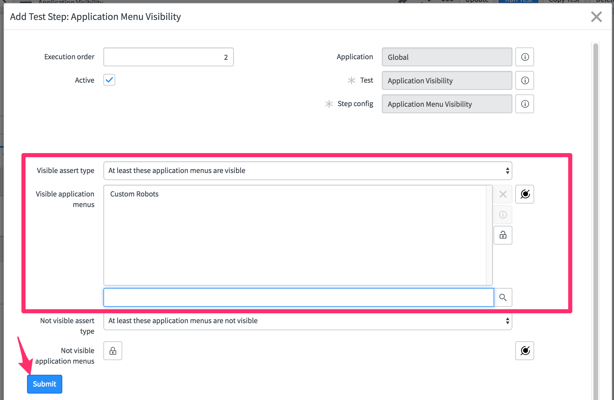

# Testing a Robot Parts Ordering system application
## Goal
The goal of this lab is to familiarize you with creating tests based on the provided Test Steps. You will be testing the Robot Parts Ordering system application that is already on your lab instance. 
Prepare for the Test

We will be using an app - currently under development - called "Custom Robots". This app allows a buyer to order robots parts via service catalog. It enables the seller to track and approve the order. We will write tests to validate critical use cases of this app.

## Log in to your provided instance
1. Navigate to the unique instance URL provided to you.
1. Log on with provided credentials.

## Run test suites
1. On your instance, locate and find the **Automated Test Framework->Suites** module and open it.
1. Open the **Test Suite with Several Successful Members** suite. Note the message that says "Running tests and test suites is disabled. Enable Tests and Test Suites Here". By default running the Automated Test Framework is disabled on any instance. Click the link to open the properties page.
1. Enable test suite execution and scheduled execution. Enable test debugging properties and set screenshot capture mode to **Disable for all steps**. Click **Save** at the bottom of the page.
    
    **Note** - in general it is good practice to enable screenshots for failed tests. For the purposes of this lab will will disable that for both speed of execution and bandwidth reasons.

1. Click the **Run Test Suite** button.
    
1. Watch the tests as they run in the opened Client Test Runner
1. Return to the original browser window. Click the **Go To Result** button and inspect the results.
    
1. Navigate back to **Suites** and open the record for **Parent Suite With A Failing Child**
1. Run that and inspect the results.
1. Look at the records under **All Test Suite Results** and examine the differences between successful and failed tests.

# Application Navigation Testing
## Goal
The goal of this section is to familiarize with how to test menu item and modules visibility of an application in application navigator

### Test whether the Module and Menu items related to app is visible to the buyer
1. Click the **Tests** module
  
  

1. Click **New**. 

1. In the **Name** add "Application Visibility" in the Description add "Test to see whether application Custom Robots and Module Orders are visible" 
1. Click **Save** to save the record

1. Click **Add Test Step** button. 

1. In the **Server** catagory Choose **Impersonate** from the list of options. Click **Next**

1. Choose "Abel Tuter" and Click **Submit** or **Update**

1. Click **Add Test Step**. Under the **Application Navigator** category choose "Application Menu Visibility". Click **Next**
1. In Visible assert type select "At least these application menus are visible"
1. In Visible application select "Custom Robots". Click **Submit** or **Update**

1. Click **Add Test Step**. Under the **Application Navigator** category choose "Module Visibility"
1. In Visible assert type select "At least these modules are visible"
1. In Visible Modules select "Orders" Click **Submit** or **Update**

1. Click **Run Test** button

1. Click **Run Test** in the "Pick a browser" model window.

# Service Catalog testing (a)
## Goal
The Goal of this section is to make sure buyer can order parts to build custom robots using the service catalog

1. Create a new **Test** record. Name it "Order Custom Robot". Right-click the header and **Save** the record
1. Click **Add Test Step** button
1. In the **Server** catagory choose **Impersonate** from the list of options. Choose "Abel Tuter" and Click **Submit** or **Update**
1. Click **Add Test Step**. Under the **Service Catalog** category choose "Search for a Catalog Item"
    1. Set the Search Term to "Customized Robot"
    1. Set Catalog to "Service Catalog"
    1. Set Category to "Robotics"
    1. Set Assert Item to "Request new product" and Click **Submit**

    

1.  Click **Add Test Step**. In the **Service Catalog** category choose "Open Catalog Item"
1.  Next to the Service Catalog variable, click the mapping icon  and in the step reference pop-up, select "Step 2: Search for a Catalog Item." > "Catalog Item ID". 
1. Click **Submit** or **Update**

1. Click **Add Test Step**. Under the **Service Catalog** category choose "Set Variables Values"
     1. Select "choose_arms " as "Articulated Clamps"
     1. Select "choose_body" as "360 rotating platform"
     1. Select "choose_head" as "Floating orb with LED face"
     1. Select "choose_legs" as "Levitation Drive" and click **Submit** or **Update**

    

1. Click **Add Test Step**. Under the **Service Catalog** category choose "Order Catalog Item". Click **Next**
1. Select Assert type as "Successfully ordered Catalog Item"

1. Click **Run Test** button
1. Click **Run Test** in the "Pick a browser" model window.

# Service Catalog testing (b)
## Goal
The Goal of this section is to make sure The above order goes thrus the approval process

1. Click "Order Custom Robot" Test in the Test Module. 
1. Click **Copy Test** button. Change the Name to "Check for Approvals" 
1. Click **Add Test Step**  Under **Server** catagory choose **Impersonate** from the list of options. Choose "ITIL User" and click **Submit**
1. Click **Add Test Steps". Under **Forms** catagory choose "Open Existing Record"
    1. In the Record secetion using mapping icon map it to "Step 5"
1. Click **Add Test Steps**. Under **Forms** catagory choose "Field Value Validation" 
    1. Select "Table" as "Request"
    1. In "Condition" dropdown select "Stage" "is" "Requested"
    1. Click "And" Button
    1. In the dropdown select "Requested for" "is" using mapping icon map it to step 1
1. Click **Add Test Step**  Under **Server** catagory choose **Impersonate** from the list of options. Choose "Eric Schroeder" and click **Submit**
1. Click **Add Test Step**  Under **Server** catagory choose **Record Query** step
    1. Select "Table" as "Approval"
    1. In the condition dropdown select "Approving" "is" using the mapping icon map it to "step 5" and click **Submit**
1. Click **Add Test Step**   Under **Forms** catagory choose **Open Existing Record** step
    1. Select "Table" as "Approval"
    1. In The Record using the mapping icon map it to step 10 and click **Submit**
1. Click **Add Test Step**   Under **Forms** catagory choose **Set Field Values** step
    1. Select "Table" as "Approval"
    1. Select "Field Value" select "State" "Approved" and click **Submit**
1. Click **Add Test Step**   Under **Forms** catagory choose **Click a UI Action** step
    1. Select "Table" as "Request"
    1. Select "UI Action" as "Save" from the reference option and click **Submit**
1. Click **Run Test** button
1. Click **Run Test** in the "Pick a browser" model window.

# Business rule testing
## Goal
The goal of this section is to demonstrate testing a business rule that generates an Order upon request approval. 

1. Click "Order Custom Robot" Test in the Test Module. 
1. Click **Copy Test** button. Change the Name to "Order created in order table" 
1. Click **Add Test Step**. Under the **Server** catagory select "Record Query" 
1. In the Table option select "Order" table
1. In the condition section select column as "Request Item". Using the gear icon reference back to Step 5
1. Click **Submit** button
1. Click **Run Test** button
1. Click **Run Test** in the "Pick a browser" model window.

# Using Run Server Script step 
## Goal
The goal of this section is to make sure when an item is returned the inventory table is updated accordingly. A business rule is executed behind the scene to update the inventory table. This lab will test if business rule was executed correctly

1. Create the test
1. Run and you should see a browser console error
1. Fix browser console error
1. re-run the test

# Add new Test Step using Step config
## Goal
The goal of this section is to familarize you with options available when you encounter client-side JavaScript error.

# Add all the test created so far and schedule it
## Goal

